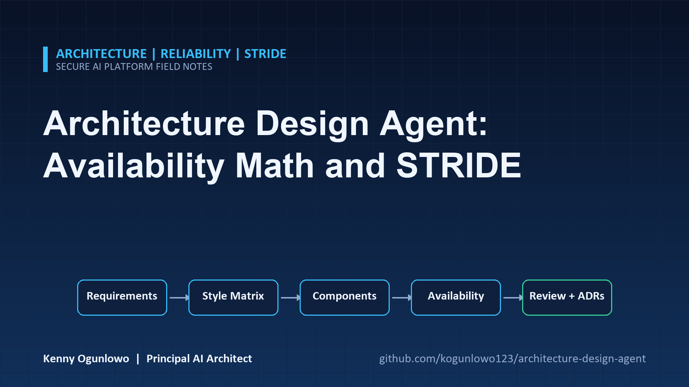
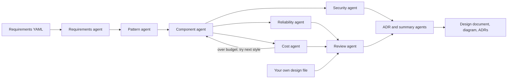

# Architecture Design Agent



**Built by [Citadel Cloud Management](https://www.linkedin.com/company/citadel-cloud-management/)** — follow on LinkedIn for more engineering work like this.

> If this project is useful, a star helps other engineers find it.

Give it a requirements file and it produces a design you can argue with: a ranked choice of architecture
style, a sized component graph, a Mermaid diagram, an availability estimate with the arithmetic shown,
a STRIDE threat model, a cost estimate, a rule-based design review, and draft ADRs. You can also point
it at a design you wrote yourself and get the same review.

It is a planning aid. Every number is derived by a named rule in the code, so you can see why the tool said
what it said and change the rule if you disagree.

## What it does

| Stage | Agent | Output |
| ----- | ----- | ------ |
| 1 | Requirements agent | Weights seven design dimensions from the requirements and lists inconsistencies as open questions |
| 2 | Pattern agent | Scores five styles (modular monolith, layered managed, microservices, event driven, serverless) with a weighted matrix, and rules out styles that cannot work |
| 3 | Component agent | Selects and sizes components for the winning style, with cloud-specific product names |
| 4 | Reliability agent | Multiplies component availability along the critical path, credits zones and standby regions, and lists single points of failure |
| 5 | Cost agent | Prices each component from catalogue rates and the workload, and suggests levers when over budget |
| 6 | Security agent | Enumerates STRIDE threats per component and marks each mitigated, partial or open |
| 7 | Review agent | Applies 22 numbered architecture rules to the design |
| 8 | ADR and summary agents | Draft decisions with their supporting numbers, and an executive summary |



The top three styles are each built and priced. If a budget is set, the best-scoring style that fits it
wins, and the report says which higher-scoring styles were passed over for cost.

## Quick start

```bash
python -m venv .venv && source .venv/bin/activate     # Windows: .venv\Scripts\activate
python -m pip install -e ".[dev]"

archagent validate configs/specs/startup-saas.yaml
archagent design configs/specs/startup-saas.yaml --out out
archagent review out/acme-projects.design.yaml --spec configs/specs/startup-saas.yaml
```

`design --out out` writes `acme-projects.design.md`, `.design.yaml`, `.mmd` and an `adr/` folder. Without
`--out` the Markdown goes to the terminal.

### A requirements file

```yaml
name: Acme Projects
capabilities: [web_ui, public_api, auth, notifications, file_storage, search]
workload: {users: 20000, peak_rps: 120, avg_payload_kb: 15, read_ratio: 0.85, data_gb: 200, growth_per_year: 1.0}
nfr: {availability_pct: 99.9, p95_latency_ms: 400, rpo_minutes: 15, rto_minutes: 120, regions: 1}
data: {classification: internal, pii: true, regulations: [gdpr]}
constraints: {cloud: aws, team_size: 6, monthly_budget_usd: 2500}
```

Three complete examples are in `configs/specs/`: a small SaaS product, a healthcare portal, and a payments
platform.

### Example output

For the file above the agent chooses a layered managed design and reports:

```text
A layered managed design with 15 components in 1 region(s). It is estimated to reach 99.895% availability
against a target of 99.9%, so the target is not met. The estimated cost is about $2,051 a month, within the
$2,500 budget.
```

The drivers explain the choice:

```text
| simplicity   | 3 | team of 6 has to build and run it        |
| availability | 2 | target 99.9% availability                |
| cost         | 2 | budget $2,500 a month                    |
| compliance   | 2 | regulated, personal or confidential data |
```

and the availability table shows the arithmetic. Eight critical components sit in series, and the identity
provider (a 99.95% managed service) is the weakest:

```text
| identity | identity | 0.99950 | 1 | 1 | 0.999500 |
| lb       | load_balancer | 0.99990 | 1 | 1 | 0.999900 |
| web      | compute  | 0.99500 | 2 | 2 | 0.999950 |
```

That is the point of the tool. A 99.9% target sounds routine, but a serial chain of managed services quietly
eats the margin. The review finding says what to do about it:

```text
ARCH-002 high  Availability target not met: about 99.895% against 99.9% (about 45 minutes of downtime a
month). identity is a managed service whose published figure caps the whole design. Choose an offering with a
higher service level, take it off the critical path, or add a standby region.
```

The payments example raises harder problems. It is asked for 99.99% availability, zero RPO, 2,500 requests
per second and a 250 ms p95 with an ML call on the path. It reports a write load of about 1,250 rps
against a single-primary capacity of 300 (ARCH-022), an availability shortfall (ARCH-002), and a latency
budget at risk (ARCH-020). It also asks whether zero RPO is really intended.

## Commands

| Command | Purpose |
| ------- | ------- |
| `design SPEC [--out DIR] [--format md,json,yaml,mmd] [--fail-on SEVERITY]` | Produce the design. `--fail-on high` exits 1 if any finding is at least that severe, for CI |
| `review DESIGN [--spec SPEC] [--target PCT] [--format md\|json] [--fail-on SEVERITY]` | Review a design file. With `--spec`, rules that compare against requirements and budget also run |
| `validate SPEC` | Check a requirements file, list drivers and open questions |
| `catalog [--cloud aws\|azure\|gcp\|any]` | List the component catalogue with products for a cloud |

Exit codes: 0 success, 1 a `--fail-on` gate failed, 2 invalid input.

## Review rules

| Rule | Checks |
| ---- | ------ |
| ARCH-001 | Single points of failure on the critical path |
| ARCH-002 | Computed availability against the target |
| ARCH-003, 004, 005 | Public data stores, unauthenticated public entry, missing identity provider |
| ARCH-006, 007 | Unencrypted connections, storage not encrypted at rest |
| ARCH-008, 009, 010 | Backups against RPO, RTO against region count, fewer regions than required |
| ARCH-011, 012 | No observability, public entry without a WAF |
| ARCH-013 | Estimate over budget |
| ARCH-014 | Microservices for a small team |
| ARCH-015, 016, 017 | Key management, audit logging for regulated data, residency with multiple regions |
| ARCH-018 | Queue without a dead-letter path |
| ARCH-019 | Technology listed in `constraints.avoid` |
| ARCH-020 | Latency budget along the request path |
| ARCH-021, 022 | Compute capacity at peak, write load against one database primary |

## How the numbers work

- Each component has a single-instance availability. Replicas only add redundancy across different zones,
  and redundancy is capped at 99.995% because failover is imperfect. Managed services use their published
  figure as-is.
- The stack availability is the product over critical components. A standby region adds
  `A + (1 - A) * A * 0.9`, assuming failover works 90% of the time.
- Compute is sized for peak load with 1.5x headroom at 150 requests per second per instance. Databases are
  sized for reads that miss the cache and warn when writes exceed one primary.
- Cost is the base price plus per-instance, per-request and per-GB charges from the catalogue, plus data
  transfer. Standby regions cost 60% extra.

All of it is in `catalog.py` and the agents. Override prices with a pricing file:

```yaml
prices:
  compute: {per_replica_monthly: 58}
  database: {per_replica_monthly: 150, per_gb_month: 0.10}
```

```bash
export ARCHAGENT_PRICING_FILE=configs/pricing.example.yaml
```

## Configuration

Environment variables use the `ARCHAGENT_` prefix. `.env.example` documents each one. An optional language
model can write the executive summary. It receives only aggregate counts (style name, availability, cost,
number of findings), never component names or your free text, and its output is discarded unless every
number in it is in those facts.

## Limitations

Read these before you rely on the output.

- Catalogue prices, availability figures and latencies are illustrative planning numbers, not quotes or
  SLAs. Replace them with your own before making commitments.
- The availability model assumes independent failures and ignores planned maintenance, deployments and
  human error. It gives a comparison between designs, not a prediction.
- The style matrix and the driver weights are judgment. They are visible and editable, but they are
  opinions.
- The tool designs for typical web and API systems. It does not model batch or streaming platforms, data
  mesh, mobile back ends with offline sync, or hardware constraints.
- Threats are a STRIDE checklist per component kind. It will not find flaws specific to your business logic.
- ADRs are drafts with status Proposed. A person still has to accept them.
- It has no live cloud integration and reads no real infrastructure.

## Development

```bash
make lint        # ruff check and format check
make typecheck   # mypy --strict
make cov         # tests with an 80% coverage gate (currently about 99%)
make audit       # pip-audit on runtime dependencies
```

The tests run offline and cover every review rule firing and not firing, the availability arithmetic, all
five styles building into valid designs, escaping in Markdown and Mermaid output, the model-summary guard,
a design-to-review round trip, and the CLI. See [CONTRIBUTING.md](CONTRIBUTING.md) and
[docs/architecture.md](docs/architecture.md).

## Docker

```bash
docker build -t architecture-design-agent .
docker run --rm -v "$PWD:/work" architecture-design-agent design configs/specs/startup-saas.yaml
```

## License

MIT. See [LICENSE](LICENSE).
