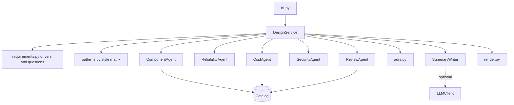

# Architecture

## Overview

`archagent` is a stateless pipeline. It reads a requirements file (or a design file), runs a fixed sequence
of agents that each take typed input and return typed output, and renders the result. The composition root
(`container.build_service`) wires the catalogue and the summary writer, and `DesignService` is the facade
the CLI and library callers use.

## Modules

| Module | Responsibility |
| ------ | -------------- |
| `models.py` | Pydantic models for requirements, designs, findings, threats, costs and reports |
| `catalog.py` | Per-kind defaults for availability, latency, capacity, price and cloud product names, with validated price overrides |
| `agents/requirements.py` | Driver weights and open questions from the requirements |
| `agents/patterns.py` | Style scoring matrix and disqualification rules |
| `agents/components.py` | Builds the component graph for a style and sizes each component |
| `agents/reliability.py` | Effective availability, series product, standby region credit, single points of failure |
| `agents/cost.py` | Per-component and total monthly cost with levers |
| `agents/security.py` | STRIDE templates per kind, control detection, status per threat |
| `agents/review.py` | Numbered rules over a design and optionally its requirements |
| `agents/adrs.py` | ADR drafts with numbers from the reports |
| `agents/summary.py` | Template and optional model-backed summary with a grounding check |
| `render.py` | Markdown, JSON, YAML, Mermaid and ADR output, with escaping |
| `service.py` | Orchestration, candidate comparison under a budget |

## Design flow

1. Derive drivers and open questions from the requirements.
2. Score the five styles. Styles the requirements rule out are marked with the reason and sorted last.
3. Build and price the top three viable styles.
4. With a budget, choose the best-scoring style that fits. Record every higher-scoring style rejected for
   cost. Without a budget, choose the top score.
5. Analyze availability, review the design, enumerate threats, and draft ADRs and the summary.

Review is the same code path for generated and hand-written designs. `review` reads a design YAML (the format
`design` writes), so a team can edit the generated design and re-check it.

## Component model

A component has a kind, replicas, zones, single-instance availability, latency, and flags such as `public`,
`authn`, `critical` and `managed_redundancy`. `critical` decides whether it sits on the serial availability
path. `managed_redundancy` means the published figure already includes redundancy, so replica counts do not
change it and it is not reported as a single point of failure.

## Security controls

`controls_present` derives a set of named controls from the design: `waf`, `rate_limit`, `authn`, `tls`,
`encryption_at_rest`, `secrets_mgmt`, `audit_logging`, `network_isolation`, `backup`, `monitoring`,
`dead_letter`. Each STRIDE template lists the controls that mitigate it. A threat is mitigated when all are
present, partial when some are, and open when none are.

## Extending

- New component kind: add it to `ComponentKind`, add a `CatalogEntry`, and handle it in the component agent.
  A test asserts the catalogue covers every kind.
- New style: add a row to `STYLE_MATRIX` and `STYLE_ORDER`, a builder in `ComponentAgent`, and the description
  in `adrs._STYLE_TEXT`.
- New rule: write a function `(Context) -> list[Finding]`, give it the next `ARCH-` number, and add it to
  `RULES`. Test both the firing and the clean case.
